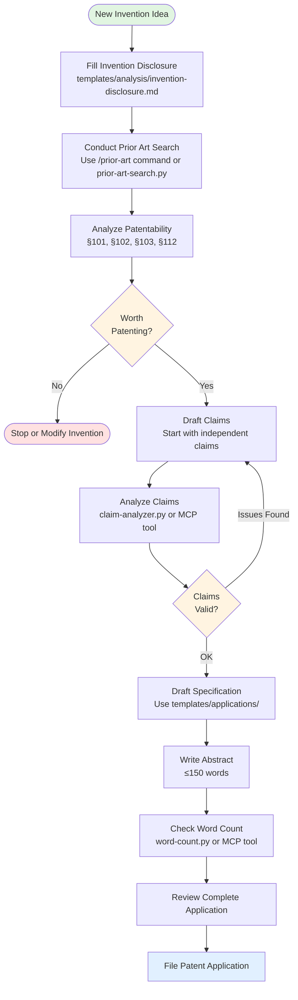
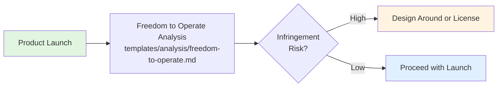

# Patent Analysis and Writing Environment

A comprehensive workspace for patent analysis, prior art searching, and patent application drafting using Claude Code.

## Overview

This repository provides a structured environment for conducting patent-related work, including:

- Patent application drafting
- Prior art analysis
- Freedom to operate (FTO) analysis
- Patentability assessments
- Invention disclosure management
- Claims analysis and drafting

## Patent Workflow Overview



### Alternative Workflows



## Directory Structure

```
patent-lawer-space/
├── patents/              # Patent documents
│   ├── drafts/          # Work in progress
│   ├── filed/           # Filed applications
│   └── analysis/        # Analysis reports
├── templates/           # Document templates
│   ├── applications/    # Patent application templates
│   ├── claims/         # Claims templates and examples
│   ├── abstracts/      # Abstract templates
│   ├── specifications/ # Detailed description templates
│   └── analysis/       # Analysis templates
├── tools/              # Utility scripts
├── mcp-server/         # Model Context Protocol server
├── docs/               # Documentation
└── examples/           # Example documents
```

## Templates

### Patent Application Templates

- **`templates/applications/utility-patent-template.md`**
  - Complete utility patent application template
  - Includes all required sections (Background, Summary, Detailed Description, Claims, Abstract)
  - Guidelines for each section

- **`templates/applications/h01l-semiconductor-template.md`** ⭐ **NEW**
  - Specialized template for H01L semiconductor device patents
  - Comprehensive guide for transistors, memory, LEDs, power devices, sensors
  - Layer-by-layer description framework with reference numbering conventions
  - Process parameter templates and material specifications
  - Multiple embodiment examples

### Claims Templates

- **`templates/claims/claims-template.md`**
  - Independent and dependent claims structure
  - Claims drafting guidelines
  - Examples of different claim types (system, method, computer-readable medium)

- **`templates/claims/h01l-claims-template.md`** ⭐ **NEW**
  - H01L semiconductor device claims
  - Device structure, process method, and specialized claim examples
  - FinFET, memory, power device, and optoelectronic claim templates
  - Semiconductor-specific claim language and best practices

### Analysis Templates

- **`templates/analysis/prior-art-analysis.md`**
  - Systematic prior art evaluation
  - Element-by-element claim charts
  - Obviousness analysis framework

- **`templates/analysis/patentability-analysis.md`**
  - Comprehensive patentability assessment
  - 35 U.S.C. § 101, 102, 103, 112 analysis
  - Prosecution strategy recommendations

- **`templates/analysis/freedom-to-operate.md`**
  - FTO/clearance analysis template
  - Risk assessment framework
  - Mitigation strategies

- **`templates/analysis/invention-disclosure.md`**
  - Invention disclosure form
  - Captures all necessary invention details
  - Prior art documentation

## ⭐ H01L Semiconductor Device Support

**NEW:** This repository now includes comprehensive support for H01L semiconductor patent work!

### What is H01L?

H01L covers semiconductor devices and electric solid-state devices including:
- Transistors (MOSFET, FinFET, GAA, HEMT, etc.)
- Memory devices (DRAM, NAND, Flash)
- Power semiconductors (IGBT, LDMOS, SiC devices)
- Optoelectronic devices (LEDs, laser diodes, solar cells)
- Sensors and MEMS devices
- Advanced packaging and assembly

### Priority Company Focus

H01L prior art searches prioritize these semiconductor industry leaders:
1. **TSMC** - Advanced process nodes, 3D IC, packaging (CoWoS, InFO)
2. **Samsung** - Memory (DRAM, NAND), logic, displays
3. **Intel** - Processors, RibbonFET, Foveros, advanced packaging
4. **ASE (Advanced Semiconductor Engineering)** - Packaging, assembly, FOWLP, SiP
5. **Amkor Technology** - Advanced packaging, SWIFT, panel-level packaging

### Quick Start for H01L

**Command:**
```
/h01l-draft
```

This launches the H01L patent drafting assistant which will:
- Guide you through semiconductor-specific information gathering
- Create H01L-specific draft files
- Recommend priority company prior art searches
- Provide semiconductor claims drafting guidance
- Generate targeted search queries

### H01L Resources

**Templates:**
- `templates/applications/h01l-semiconductor-template.md` - Complete H01L application template
- `templates/claims/h01l-claims-template.md` - Semiconductor claims examples

**Guides:**
- `docs/h01l-quick-start.md` - **START HERE** for H01L patent work
- `docs/h01l-terminology-reference.md` - 300+ semiconductor terms with definitions
- `docs/h01l-prior-art-search-guide.md` - Search strategies for priority companies

### Why H01L Support Matters

Semiconductor patents require:
- **Specialized terminology** (gate dielectric, source/drain, doping concentration, etc.)
- **Precise specifications** (dimensional ranges, process parameters, material properties)
- **Thorough prior art searches** (TSMC, Samsung, Intel, ASE, Amkor dominate the field)
- **Technical accuracy** (realistic process parameters, achievable dimensions)
- **Proper structure** (layer-by-layer descriptions, systematic reference numbering)

The H01L templates and guides ensure your semiconductor patents meet these requirements.

### Example H01L Use Cases

- Drafting FinFET or GAA transistor patents
- Memory device patent applications (3D NAND, DRAM)
- Advanced packaging patents (fan-out, TSV, SiP)
- Power semiconductor patents (SiC, GaN devices)
- LED and optoelectronic device patents
- Prior art searching for semiconductor technologies
- FTO analysis for chip products

**Get Started:** Read `docs/h01l-quick-start.md` or run `/h01l-draft`

## Tools

The repository includes both standalone Python tools and an MCP server that exposes these tools to Claude.

### MCP Server (Recommended for Claude Desktop)

The **Model Context Protocol (MCP) server** makes all patent analysis tools available directly to Claude through the MCP protocol. This is the recommended way to use the tools with Claude Desktop.

**Quick Setup:**

1. Install dependencies:
   ```bash
   cd mcp-server
   pip install -r requirements.txt
   ```

2. Configure Claude Desktop (see `mcp-server/README.md` for details):
   ```json
   {
     "mcpServers": {
       "patent-tools": {
         "command": "python",
         "args": ["/absolute/path/to/patent-lawer-space/mcp-server/run.py"]
       }
     }
   }
   ```

3. Restart Claude Desktop and the tools will be available automatically!

**Available MCP Tools:**
- `analyze_patent_word_count` - Word count and structure validation
- `analyze_patent_claims` - Claims analysis with antecedent basis checking
- `generate_prior_art_search` - Prior art search query generation

See [mcp-server/README.md](mcp-server/README.md) for complete documentation.

### Standalone Python Tools

These tools can also be run directly from the command line:

### Word Count Tool

Analyzes patent documents and checks word count against requirements.

```bash
cd tools
python word-count.py ../templates/abstracts/my-abstract.md
```

Features:
- Counts words excluding markdown formatting
- Checks abstracts against 150-word limit
- Verifies document structure

### Claims Analyzer

Analyzes patent claims for common issues and best practices.

```bash
cd tools
python claim-analyzer.py ../templates/claims/my-claims.md
```

Features:
- Identifies independent vs. dependent claims
- Checks antecedent basis
- Analyzes claim structure
- Provides suggestions for improvement

### Prior Art Search Helper

Generates search queries and strategies for prior art searching.

```bash
cd tools
python prior-art-search.py ../patents/drafts/my-invention.md
```

Features:
- Extracts keywords from invention description
- Generates Boolean search queries
- Suggests CPC classifications
- Recommends search databases and strategy

## Quick Start Guide

### For Newcomers: 3 Easy Steps

**Step 1: Start with a simple invention**
```bash
# Ask Claude to help you draft a patent
"I have an invention for [describe your invention].
Help me create a patent application using the utility patent template."
```

**Step 2: Use slash commands for guidance**
```bash
/draft-patent      # Start a new patent application
/prior-art         # Search for prior art
/analyze-claims    # Check your claims for issues
```

**Step 3: Let Claude guide you through the process**
- Claude will ask questions about your invention
- Follow the workflow diagram above
- Use the tools to validate your work

### For Advanced Users: Direct Tool Usage

**Option A: Use MCP Tools (Recommended for Claude Desktop)**
- Tools are automatically available in Claude Desktop
- Just ask Claude to analyze claims, check word count, or generate search queries
- See [mcp-server/README.md](mcp-server/README.md) for setup

**Option B: Use Python Tools Directly**
```bash
# Analyze patent claims
python tools/claim-analyzer.py patents/drafts/my-claims.md

# Check word count (abstracts must be ≤150 words)
python tools/word-count.py patents/drafts/my-abstract.md

# Generate prior art search queries
python tools/prior-art-search.py patents/drafts/my-invention.md
```

### Example: Complete Patent Workflow

**Starting a new patent application:**
```
You: "I need to patent a new smartphone battery design that uses
graphene electrodes. Can you help me draft the application?"

Claude: "I'll guide you through the patent workflow:
1. First, let me gather details about your invention...
2. Conduct a prior art search on graphene battery technologies...
3. Draft independent and dependent claims...
4. Create the specification with multiple embodiments...
5. Validate everything with the analysis tools..."
```

**For H01L semiconductor patents:**
```bash
/h01l-draft    # Specialized workflow for semiconductor devices
```
This command provides semiconductor-specific guidance for transistors, memory, LEDs, packaging, etc.

## Best Practices

### Patent Drafting

1. **Start with Invention Disclosure**: Use the invention disclosure template to capture all details
2. **Conduct Prior Art Search First**: Understand the landscape before drafting
3. **Draft Claims Early**: Claims define the scope - start here
4. **Multiple Embodiments**: Describe various implementations
5. **Consistent Terminology**: Use the same terms throughout
6. **Reference Numbers**: Assign and use systematically
7. **Figures**: Create clear diagrams with proper labeling

### Claims Drafting

1. **Independent Claims**: Start broad, cover core inventive concept
2. **Dependent Claims**: Add specific implementations and alternatives
3. **Claim Differentiation**: Each claim should add value
4. **Clear Language**: Avoid ambiguity
5. **Antecedent Basis**: Proper use of "a/an" and "the"
6. **Multiple Claim Types**: Include system, method, and CRM claims if applicable

### Prior Art Analysis

1. **Systematic Search**: Use multiple databases and search strategies
2. **Document Everything**: Record search queries and results
3. **Element-by-Element**: Compare each claim element to prior art
4. **Consider Combinations**: Analyze obviousness from combinations
5. **Update Regularly**: Prior art landscape changes

### Analysis Documentation

1. **Be Thorough**: Complete all sections of analysis templates
2. **Objective Assessment**: Honest evaluation of strengths and weaknesses
3. **Support Conclusions**: Provide evidence and reasoning
4. **Consider Alternatives**: Multiple strategies and approaches
5. **Regular Updates**: Keep analyses current

## Working with Claude Code

This environment is optimized for use with Claude Code. Simply describe what you need in natural language:

**Drafting:**
```
"Help me draft a patent application for [your invention idea]"
```

**Analysis:**
```
"Analyze the patentability of my invention - check for prior art issues"
```

**Claims:**
```
"Draft independent and dependent claims for my invention"
```

**Prior Art Search:**
```
"Search for prior art related to [technology area]"
```

**Review:**
```
"Review my claims for antecedent basis and structural issues"
```

**Use Slash Commands for specialized workflows:**
- `/draft-patent` - Complete patent drafting workflow
- `/prior-art` - Comprehensive prior art search
- `/patentability` - Full patentability analysis (§101, §102, §103, §112)
- `/analyze-claims` - Claims structure and validity check
- `/fto` - Freedom to operate analysis
- `/h01l-draft` - Semiconductor device patent drafting

## Patent Law Fundamentals

### Patentability Requirements (U.S.)

1. **35 U.S.C. § 101 - Eligible Subject Matter**
   - Process, machine, manufacture, or composition of matter
   - Not abstract idea, law of nature, or natural phenomenon

2. **35 U.S.C. § 102 - Novelty**
   - New (not in prior art)
   - Each claim element must be novel

3. **35 U.S.C. § 103 - Non-Obviousness**
   - Not obvious to person skilled in the art
   - Must have inventive step beyond prior art

4. **35 U.S.C. § 112 - Written Description, Enablement, Definiteness**
   - Adequate description of invention
   - Enables others to make and use
   - Claims are clear and definite

### Key Deadlines

- **Provisional to Non-Provisional**: 12 months
- **Public Disclosure**: File before or within grace period (1 year in U.S.)
- **PCT Filing**: 12 months from priority date
- **Office Action Response**: Typically 3-6 months
- **Foreign Filings**: 30 months from priority (via PCT)

### Patent Types

- **Utility Patent**: Functional inventions (20 years)
- **Design Patent**: Ornamental designs (15 years)
- **Plant Patent**: New plant varieties (20 years)
- **Provisional**: Placeholder (not examined, 12-month term)

## Common Workflows

See the **Mermaid diagrams** at the top of this document for visual workflow guidance.

### New Invention Workflow

**Quick Version:** Invention Disclosure → Prior Art Search → Draft Claims → Draft Specification → Abstract → File

**Detailed Steps:**
1. Fill out invention disclosure (`/invention-disclosure`)
2. Prior art search (`/prior-art`)
3. Assess patentability
4. Draft claims (start broad, add dependencies)
5. Draft specification (use templates)
6. Create abstract (≤150 words)
7. Review and file

### Prior Art Analysis Workflow

**Quick Version:** Keywords → Search → Document → Analyze → Update Claims

**Detailed Steps:**
1. Extract keywords and generate queries (`prior-art-search.py`)
2. Search USPTO, Google Patents, academic databases
3. Document each relevant reference
4. Create claim charts (element-by-element comparison)
5. Update claims to distinguish from prior art

### FTO Analysis Workflow

**Quick Version:** Product Features → Search Patents → Analyze Claims → Assess Risk → Mitigate

**Detailed Steps:**
1. List all product features
2. Search for relevant patents (`/fto`)
3. Map patent claims to product features
4. Assess infringement and validity
5. Develop mitigation strategy (design-around, licensing, etc.)

## Resources

### Patent Databases

- **USPTO**: https://patft.uspto.gov/
- **Google Patents**: https://patents.google.com/
- **Espacenet**: https://worldwide.espacenet.com/
- **WIPO PatentScope**: https://patentscope.wipo.int/

### Classification Systems

- **CPC** (Cooperative Patent Classification): https://www.cooperativepatentclassification.org/
- **IPC** (International Patent Classification): https://www.wipo.int/classifications/ipc/

### Non-Patent Literature

- **IEEE Xplore**: https://ieeexplore.ieee.org/
- **Google Scholar**: https://scholar.google.com/
- **PubMed**: https://pubmed.ncbi.nlm.nih.gov/

### Guidelines and Rules

- **MPEP** (Manual of Patent Examining Procedure): https://www.uspto.gov/web/offices/pac/mpep/
- **USPTO Rules**: https://www.uspto.gov/patents/laws

## Tips for Success

1. **Document Everything**: Keep detailed records of all work
2. **Version Control**: Track changes to applications and analyses
3. **Consistent Naming**: Use clear, descriptive file names
4. **Regular Backups**: Protect your work
5. **Collaborate**: Use this environment for team collaboration
6. **Stay Current**: Patent law and technology evolve
7. **Professional Review**: Consider professional patent attorney review for final applications

## Contributing

This is a template environment. Customize it for your specific needs:

- Add industry-specific templates
- Create custom analysis tools
- Develop additional scripts
- Add reference materials
- Include sample patents from your field

## License

This template repository is provided as-is for patent analysis and drafting work.

## Disclaimer

This environment and its templates are for informational purposes only and do not constitute legal advice. For actual patent applications, consult with a registered patent attorney or agent. Patent laws vary by jurisdiction and change over time.

---

**Version**: 1.0
**Last Updated**: 2026-01-04
**Maintained for**: Claude Code patent analysis and writing workflows
